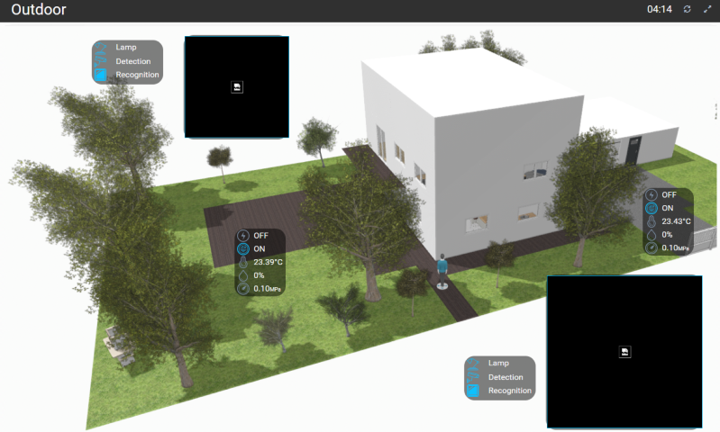
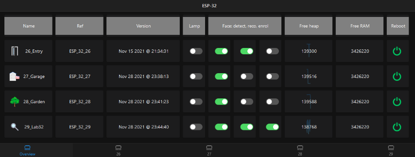
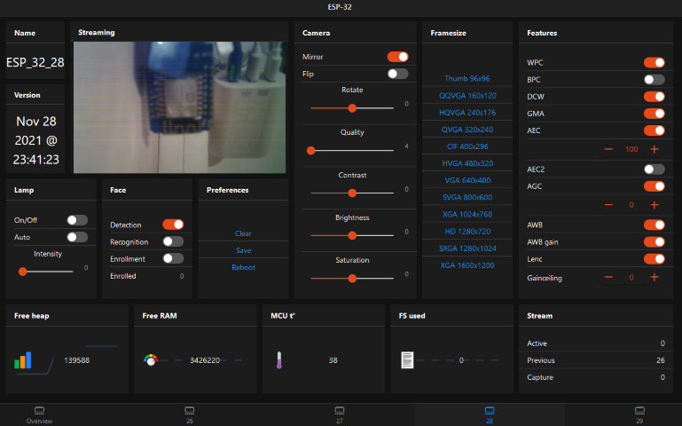
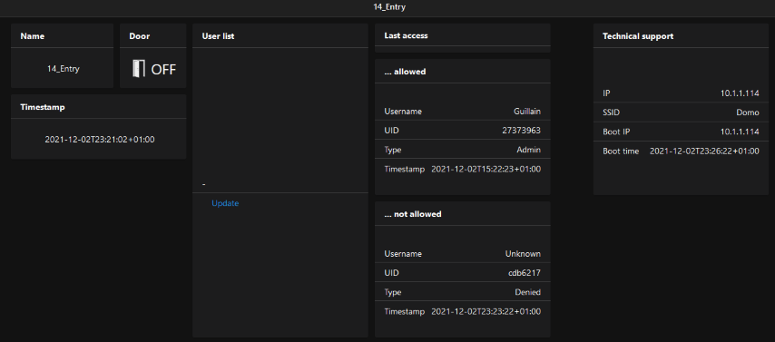

# Domo

Solution to deploy, provision and manage all pieces of puzzle of a domotic system.

- Platform: [Raspberry 3b+](https://www.raspberrypi.com/products/raspberry-pi-3-model-b-plus/)
  and [ESP](https://fr.wikipedia.org/wiki/ESP32) (32/8266)
- Network: [RaspAP](https://raspap.com/) (AP, DHCP, DNS, Firewall)
- Domotic: [OpenHab3](https://www.openhab.org/blog/2020-12-21-openhab-3-0-release.html) including Things, Items and
  their Links and Rules

As example, ESP 32 and 8266 setup and templates are provided with the following features
(cf. [Integration matrix](./doc/Integration_matrix.md)):

- Web camera (streaming, control, monitoring)
- RFID (scan, enrolment, opendoor)
- Sensors (control, monitoring, alerting)
- System (monitoring, alerting)

## Presentation

### Frontend

<table style="width: 100%; text-align: center;">
    <thead>
        <tr>
            <th>Overview</th>
            <th colspan="2=">Layer</th>
        </tr>
    </thead>
    <tbody>
        <tr>
            <td rowspan=4 style="width: 40%;"></td>
            <td style="width: 10%;">Second</td>
            <td style="width: 50%;"></td>
        </tr>
        <tr>
            <td>First</td>
            <td></td>
        </tr>
        <tr>
            <td>Ground</td>
            <td></td>
        </tr>
        <tr>
            <td>Outdoor</td>
            <td></td>
        </tr>
    </tbody>
</table>

### Backend

<table style="width: 100%; text-align: center;">
    <thead>
        <tr>
            <th style="width: 28%;">Usage</th>
            <th style="width: 24%;">Hardware</th>
            <th style="width: 24%;">Overview</th>
            <th style="width: 24%;">Details</th>
        </tr>
    </thead>
    <tbody>
        <tr>
            <td>Infra</td>
            <td></td>
            <td></td>
            <td></td>
        </tr>
        <tr>
            <td>Web cam</td>
            <td></td>
            <td></td>
            <td></td>
        </tr>
        <tr>
            <td>Sensors <ul><li>temperature</li><li>luminosity</li><li>humidity</li><li>sound</li><li>presence</li><li>motion (gyro)</li><li>water pump</li><li>sole moisture</li><li>air quality</li></ul></td>
            <td></td>
            <td></td>
            <td></td>
        </tr>
        <tr>
            <td>RFID</td>
            <td></td>
            <td></td>
            <td></td>
        </tr>
    </tbody>
</table>

## Overview

- [Infrastructure](doc/Infrastructure.md#overview)
- [Integration matrix](doc/Integration_matrix.md)
- [Provisioning script](doc/Provisioning_script.md)

## Installation

1. [Infrastructure](doc/Infrastructure.md)
    1. [OpenHABian](doc/OpenHABian.md)
        1. [Installation](doc/OpenHABian.md#installation)
        2. [Post installation](doc/OpenHABian.md#post-installation)
        3. [Addons](doc/OpenHABian.md#addons)
        4. [Tuning](doc/OpenHABian.md#tuning)
    2. [RaspAP](doc/RaspAP.md)
        1. [Installation](doc/RaspAP.md#installation)
        2. [First connection](doc/RaspAP.md#first-connection)
        3. [Configuration](doc/RaspAP.md#configuration)
    3. [ESP](doc/ESP.md)
        1. [ESP-32-Cam](doc/ESP_32_Cam.md)
            1. [Setup](doc/ESP_32_Cam.md#setup)
            2. [Templates](doc/ESP_32_Cam.md#templates)
            3. [Programming](doc/ESP_32_Cam.md#programming)
        2. [ESP-8266-RFID](doc/ESP_8266_RFID.md)
            1. [Setup](doc/ESP_8266_RFID.md#setup)
            2. [Templates](doc/ESP_8266_RFID.md#templates)
            3. [Programming](doc/ESP_8266_RFID.md#programming)
        3. [ESP-8266-Sensors](doc/ESP_8266_Sensors.md)
            1. [Setup](doc/ESP_8266_Sensors.md#setup)
            2. [Templates](doc/ESP_8266_Sensors.md#templates)
            3. [Programming](doc/ESP_8266_Sensors.md#programming)
2. [OpenHab 3](doc/OpenHAB3.md)
    1. [Installation](doc/OpenHAB3.md#installation)
    2. [Configuration](doc/OpenHAB3.md#configuration)
3. [HABPanel](doc/HABPanel.md)
   1. [Installation](doc/HABPanel.md#installation)
   2. [Configuration](doc/HABPanel.md#configuration)

## Provisioning

1. Configuration (mean **TEMPLATE**)
    1. [ESP](doc/ESP.md#template)
    2. [OpenHAB](doc/OpenHAB3.md#templates)
    3. [HABPanel](doc/HABPanel.md#templates)
2. [OpenHAB management](doc/Provisioning_script.md)
   