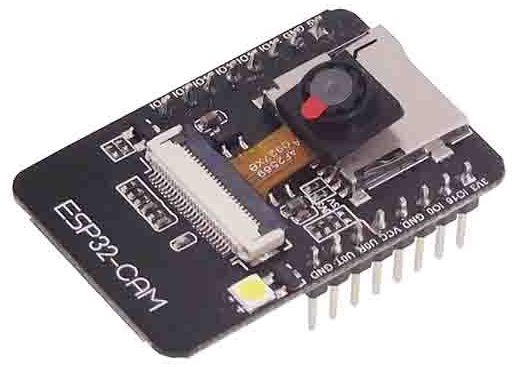
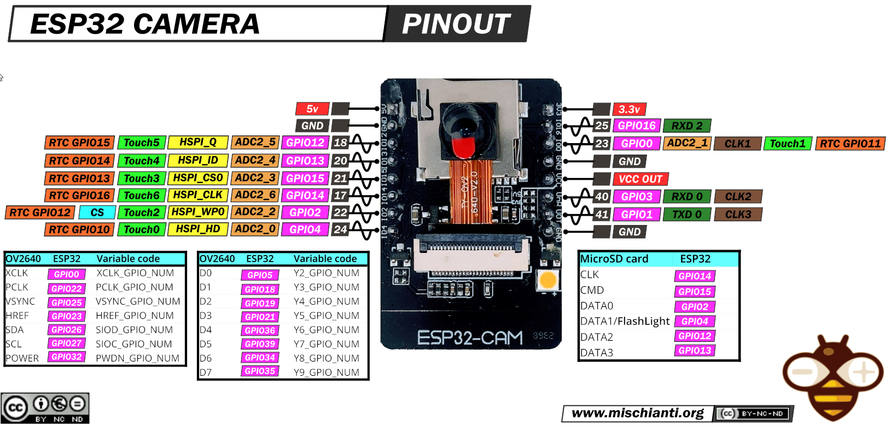

# ESP-32-Cam

1. [Hardware](#hardware)
   1. [Pinout](#pinout)
1. [Firmware](#firmware)
    1. [Source](#source)
    2. [Download](#download)
2. [Integration](#integration)
3. [Setup](#setup)
4. [Templates](#templates)
    1. [Files](#files)
    2. [Constants](#constants)
        1. [Warning](#warning)
5. [Programming](#programming)
6. [Access](#access)
    1. [Web & API](#web--api)
    2. [Streaming](#streaming)
7. [Links](#links)

## Hardware
Using a cheaper and simple `ESP-32-Cam`: 

### Pinout
- 

## Firmware

It comes from the release with all necessary files into the archive.

### Source

[https://github.com/easytarget/esp32-cam-webserver](https://github.com/easytarget/esp32-cam-webserver)

### Download

[https://github.com/easytarget/esp32-cam-webserver/tags](https://github.com/easytarget/esp32-cam-webserver/tags)
[https://github.com/easytarget/esp32-cam-webserver/releases](https://github.com/easytarget/esp32-cam-webserver/releases)

## Integration
- [Cf. Integration matrix/ESP_32_Cam](Integration_matrix.md#ESP_32_Cam)

## Setup

1. Uncompress the release file `esp32-cam-webserver-VERSION.zip` downloaded
2. Use the file TEMPLATE of the setup provided to configure your firmware/device:

- `ESP/ESP_32_Cam/myconfig_TEMPLATE.h`

## Templates

### Files

| Component | Sub component | Template file                                        | Generated file                                                   | Comment      |
|-----------|---------------|------------------------------------------------------|:-----------------------------------------------------------------|--------------|
| ESP       | PlatformIO    | `ESP/ESP_32_Cam/platformio.ini`                      | `generated/ESP/ESP_32_Cam/platformio.ini`                        |              |
| ESP       | Firmware      | `ESP/ESP_32_Cam/myconfig_TEMPLATE.h`                 | `generated/ESP/ESP_32_Cam/myconfig_[ESP_NAME].h`                 |              |
| OpenHAB   | API           | `OpenHAB/API/ESP_32_Cam/items_TEMPLATE.json`         | `generated/OpenHAB/API/ESP_32_Cam/items_[ESP_NAME].json`         |              | 
| OpenHAB   | API           | `OpenHAB/API/ESP_32_Cam/links_TEMPLATE.json`         | `generated/OpenHAB/API/ESP_32_Cam/links_[ESP_NAME].json`         |              | 
| OpenHAB   | API           | `OpenHAB/API/ESP_32_Cam/rules_TEMPLATE.json`         | `generated/OpenHAB/API/ESP_32_Cam/rules_[ESP_NAME].json`         |              | 
| OpenHAB   | API           | `OpenHAB/API/ESP_32_Cam/things_TEMPLATE.json`        | `generated/OpenHAB/API/ESP_32_Cam/things_[ESP_NAME].json`        |              | 
| OpenHAB   | Web pages     | `OpenHAB/web_pages/ESP_32_Cam/Overview_HEADER.yml`   | `generated/OpenHAB/web_pages/ESP_32_Cam/Overview.yml`            |              |
| OpenHAB   | Web pages     | `OpenHAB/web_pages/ESP_32_Cam/Overview_TEMPLATE.yml` | `generated/OpenHAB/web_pages/ESP_32_Cam/Overview_[ESP_NAME].yml` |              |
| OpenHAB   | Web pages     | `OpenHAB/web_pages/ESP_32_Cam/Page_TEMPLATE.yml`     | `generated/OpenHAB/web_pages/ESP_32_Cam/Page_[ESP_NAME].yml`     |              |
| HABPanel  | Web pages     | `HABOpen/web_pages/ESP_32_Cam/Camera_TEMPLATE.yml`   | `generated/HABOpen/web_pages/ESP_32_Cam/Camera_[ESP_NAME].yml`   |              |
| NodeRED   | Workflow      | `NodeRED/ESP_32_Cam/functions.json`                  | `generated/NodeRED/ESP_32_Cam/functions.json`                    | no more used |
| NodeRED   | Workflow      | `NodeRED/ESP_32_Cam/settings_TEMPLATE.json`          | `generated/NodeRED/ESP_32_Cam/settings_[ESP_NAME].json`          | no more used |

### Constants

- ESP_NAME
- ESP_REFERENCE
- AP_SSID
- AP_SSID_PASSWORD
- OPENHAB_WEB_URL

#### Warning

IP addresses must be separated with commas (,) and not decimals (.).

Thanks to do it manually if you need to change the standard conf.

````commandline
... l.59
#define ST_IP       10,1,1,1ESP_REFERENCE
#define ST_GATEWAY  10,1,1,1
#define ST_NETMASK  255,255,255,0
#define ST_DNS1     10,1,1,1
````

## Programming

Follow the editor's guide ([README.md](https://github.com/easytarget/esp32-cam-webserver#setup) file) and don't miss
importing the previous TEMPLATE file as settings (cf. [setup](#setup)).

In summary:

1. Connect your ESP-32-Cam to your PC via USB
2. **Only when flashing**, connect the _GPI0_ to the _Ground_
3. Install and open the [Arduino](https://www.arduino.cc/en/software) IDE
4. Open the Arduino sketch: _esp32-cam-webserver.ino_ (from the uncompressed archive :)
5. Configure the Arduino compiler
    1. Install the driver for the board _esp32_
    2. Select the board: AI Thinker ESP32-CAM
    3. Select your USB port
6. Run the _check and compile_ command

Ready to be used!

## Access

Pretty well documented [here](https://github.com/easytarget/esp32-cam-webserver/blob/master/API.md).

### Web & API

- TCP Port:  **80** (cf. `ESP/ESP_32_Cam/myconfig_TEMPLATE.h` l.96)
- Flow: **In/Out**
    ````commandline
    /                             - Default index
    /?target=full|simple|portal   - Go direct to specific index
    /capture                      - Return a Jpeg snapshot image
    /status                       - Returns a JSON string with all camera status / pairs listed
    /control?var=<key>&val=<val>  - Set <key> to <val>
    /dump - Status page
    ````

### Streaming

- TCP Port: **8080** (cf. `ESP/ESP_32_Cam/myconfig_TEMPLATE.h` l.97)
- Flow: **Out**
    ````commandline
    /                             - Raw stream
    /view                         - Stream viewer
    ````

## Links

- MQTT commands: https://github.com/easytarget/esp32-cam-webserver/blob/master/API.md
