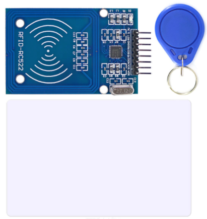
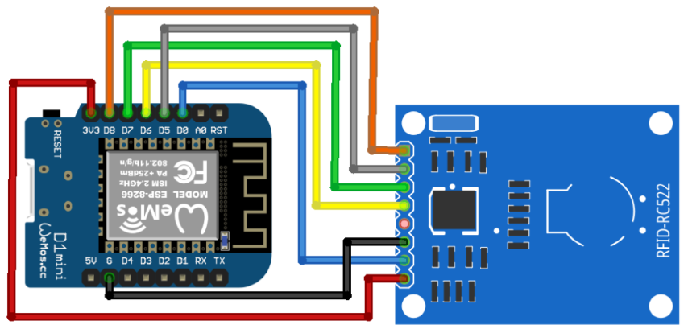

# ESP-8266-RFID

1. [Hardware](#hardware)
   1. [Pinout](#pinout)
1. [Firmware](#firmware)
    1. [Source](#source)
    2. [Download](#download)
2. [Integration](#integration)
3. [Setup](#setup)
4. [Templates](#templates)
    1. [Files](#files)
    2. [Constants](#constants)
5. [Programming](#programming)
6. [Access](#access)
    1. [Web](#web)
    2. [MQTT](#mqtt)
        1. [Topics](#topics)
        2. [Commands](#commands)
            1. [Original](#original)
            2. [Enriched - **WIP**](#enriched---wip)
7. [Links](#links)

## Hardware
Using a cheaper and simple `RC522`: 

### Pinout
- 
- 

## Firmware

It comes from the release with all necessary files into the archive.

### Source

[https://github.com/esprfid/esp-rfid/](https://github.com/esprfid/esp-rfid/)

### Download

[https://github.com/esprfid/esp-rfid/releases](https://github.com/esprfid/esp-rfid/releases)

## Integration

- [Cf. Integration matrix/ESP_8266_RFID](Integration_matrix.md#ESP_8266_RFID)

## Setup

1. Uncompress the release file `esprfid-VERSION.zip` downloaded
2. Use the file TEMPLATE provided for the settings and the user file to configure your firmware/device:

## Templates

### Files

| Component | Sub component | Template file                                           | Generated file                                                      | Comment      |
|-----------|---------------|---------------------------------------------------------|:--------------------------------------------------------------------|--------------|
| ESP       | PlatformIO    | `ESP/ESP_8266_RFID/platformio.ini`                      | `generated/ESP/ESP_8266_RFID/platformio.ini`                        |              |
| ESP       | Firmware      | `ESP/ESP_8266_RFID/users.json`                          | `generated/ESP/ESP_8266_RFID/users.json`                            |              |
| ESP       | Firmware      | `ESP/ESP_8266_RFID/settings_TEMPLATE.json`              | `generated/ESP/ESP_8266_RFID/settings_[ESP_NAME].json`              |              |
| OpenHAB   | API           | `OpenHAB/API/ESP_8266_RFID/items_TEMPLATE.json`         | `generated/OpenHAB/API/ESP_8266_RFID/items_[ESP_NAME].json`         |              | 
| OpenHAB   | API           | `OpenHAB/API/ESP_8266_RFID/links_TEMPLATE.json`         | `generated/OpenHAB/API/ESP_8266_RFID/links_[ESP_NAME].json`         |              | 
| OpenHAB   | API           | `OpenHAB/API/ESP_8266_RFID/rules_TEMPLATE.json`         | `generated/OpenHAB/API/ESP_8266_RFID/rules_[ESP_NAME].json`         |              | 
| OpenHAB   | API           | `OpenHAB/API/ESP_8266_RFID/things_TEMPLATE.json`        | `generated/OpenHAB/API/ESP_8266_RFID/things_[ESP_NAME].json`        |              | 
| OpenHAB   | Web pages     | `OpenHAB/web_pages/ESP_8266_RFID/Overview_HEADER.yml`   | `generated/OpenHAB/web_pages/ESP_8266_RFID/Overview.yml`            |              |
| OpenHAB   | Web pages     | `OpenHAB/web_pages/ESP_8266_RFID/Overview_TEMPLATE.yml` | `generated/OpenHAB/web_pages/ESP_8266_RFID/Overview_[ESP_NAME].yml` |              |
| OpenHAB   | Web pages     | `OpenHAB/web_pages/ESP_8266_RFID/Page_TEMPLATE.yml`     | `generated/OpenHAB/web_pages/ESP_8266_RFID/Page_[ESP_NAME].yml`     |              |
| HABPanel  | Web pages     | `HABOpen/web_pages/ESP_8266_RFID/RFID_TEMPLATE.yml`     | `generated/HABOpen/web_pages/ESP_8266_RFID/RFID_[ESP_NAME].yml`     |              |
| NodeRED   | Workflow      | `NodeRED/ESP_8266_RFID/functions.json`                  | `generated/NodeRED/ESP_8266_RFID/functions.json`                    | no more used |
| NodeRED   | Workflow      | `NodeRED/ESP_8266_RFID/settings_TEMPLATE.json`          | `generated/NodeRED/ESP_8266_RFID/settings_[ESP_NAME].json`          | no more used |

### Constants

- ESP_NAME
- ESP_REFERENCE
- ESP_IP_PATTERN
- ESP_IP_ADDRESS
- ESP_IP_SUBNET
- ESP_RFID_PASSWORD
- ESP_RFID_MQTT_USER
- ESP_RFID_MQTT_PASSWORD
- AP_SSID
- AP_SSID_PASSWORD
- AP_BSSID
- AP_IP_GW
- AP_IP_SUBNET
- OPENHAB_WEB_URL

## Programming

Follow the editor's guide ([README.md](https://github.com/esprfid/esp-rfid#readme) file).

In summary: depending on your pf

- Windows: **Using Compiled Binaries**: Download compiled binaries from GitHub Releases
  page https://github.com/esprfid/esp-rfid/releases On Windows you can use "flash.bat", it will ask you which COM port
  that ESP is connected and then flashes it.
- Building With PlatformIO: The build environment is based on PlatformIO. Follow the instructions found
  here: http://platformio.org/#!/get-started for installing it but skip the platform init step as this has already been
  done, modified and it is included in this repository.

````commandline
sudo pip install -U pip setuptools
sudo pip install -U platformio
git clone https://github.com/esprfid/esp-rfid.git
cd esp-rfid
platformio run -t clean
platformio run
````

Ready to be used!

## Access

Pretty well documented [here](https://github.com/easytarget/esp32-cam-webserver/blob/master/API.md).

### Web

- TCP Port:  **80**
- Flow: **In/Out**

### MQTT

- TCP Port: **1883**
- Flow: **In/Out**

#### Topics

OH3 enriches the original MQTT collection through the _OH3 Rules_ to provide additional MQTT stories for an easy-to-use
mode.

##### Original

| Category | Name      | Topic                              | Value  | Value type | Value definition                                                                                                                             |
|----------|-----------|------------------------------------|--------|------------|----------------------------------------------------------------------------------------------------------------------------------------------|
| RFID     | Boot      | `ESP/8266/ESP_REFERENCE/rfid`      | json   | string     | `{"type":"boot","time":2,"Wifi SSID":"Domo","Local IP":"10.1.1.114"}`                                                                        |
| RFID     | Heartbeat | `ESP/8266/ESP_REFERENCE/rfid/sync` | json   | string     | `{"type":"heartbeat","time":43434,"ip":"10.1.1.114","door":"14_Entry"}`                                                                      |
| RFID     | Access    | `ESP/8266/ESP_REFERENCE/rfid/send` | json   | string     | `{"cmd":"log","type":"access","time":23852,"isKnown":"true","access":"Admin","username":"Guillain","uid":"27373963","door":"14_Entry"}`      |
| RFID     | Access    | `ESP/8266/ESP_REFERENCE/rfid/send` | json   | string     | `{"cmd":"log","type":"access","time":23848,"isKnown":"false","access":"Denied","username":"Unknown","uid":"cdb6217","door":"14_Entry"}`      |
| RFID     | Info      | `ESP/8266/ESP_REFERENCE/rfid/send` | json   | string     | `{"type":"INFO","src":"wifi","desc":"Enabling WiFi","data":"","time":23852,"cmd":"event","door":"14_Entry"}`                                 |
| RFID     | Warning   | `ESP/8266/ESP_REFERENCE/rfid/send` | json   | string     | `{"type":"WARN","src":"rfid","desc":"Unknown rfid tag is scanned","data":"cdb6217 MIFARE 1KB","time":23848,"cmd":"event","door":"14_Entry"}` |

##### Enriched - **WIP**
Setup in: `OpenHAB/ESP_8266_RFID/rules_TEMPLATE.txt`

| Category | Name    | Topic                                   | Value  | Value type | Value definition                                                       |
|----------|---------|-----------------------------------------|--------|------------|------------------------------------------------------------------------|
| System   | Event   | `ESP/8266/ESP_REFERENCE/system`         | json   | string     | `{"name":"","ip":"","uptime":"","boot_ip":"","boot_time":"",time":""}` |
| Network  | Event   | `ESP/8266/ESP_REFERENCE/network`        | json   | string     | `{"ip":"","SSID":"","BSSID":"","subnet":""}`                           |
| Domotic  | Door    | `ESP/8266/ESP_REFERENCE/door`           | [0,1]  | boolean    | When the door is switched to be opened                                 |
| Access   | Last    | `ESP/8266/ESP_REFERENCE/access/last`    | json   | string     | `{"name":"","uid":"","type":"","time":"","isknown":""}`                |
| Access   | Last Ok | `ESP/8266/ESP_REFERENCE/access/last_ok` | json   | string     | `{"name":"","uid":"","type":"","time":""}`                             |
| Access   | Last Ko | `ESP/8266/ESP_REFERENCE/access/last_ko` | json   | string     | `{"name":"","uid":"","type":"","time":""}`                             |
| Access   | Last Ko | `ESP/8266/ESP_REFERENCE/access/last_ko` | json   | string     | `{"name":"","uid":"","type":"","time":""}`                             |
| RFID     | Users   | `ESP/8266/ESP_REFERENCE/rfid/users`     | json   | string     | `{"name":"","uid":"","type":"","time":""}`                             |

#### Commands
- `mosquitto_pub -h [MQTT_HOST] -t [TOPIC_COMMAND] -m '{"doorip":"[ESP_IP_ADDRESS]","cmd":"[ACTION]"}'`
- Where
  - [MQTT_HOST]: Host providing the MQTT server, should be _Domo_
  - [TOPIC_COMMAND]: Topic to be reached by the command
  - [ESP_IP_ADDRESS]: ESP IP address reachable over the network
  - [ACTION]: requested action

| Category | Action     | Topic command                 | Topic value                                        | Result topic | Command result   |
|----------|------------|-------------------------------|----------------------------------------------------|--------------|------------------|
| User     | List       | `ESP/8266/ESP_REFERENCE/rfid` | `{"doorip":"[ESP_IP_ADDRESS]","cmd":"listusr"}`    | nan          | List the users   |
| User     | Get        | `ESP/8266/ESP_REFERENCE/rfid` | `{"doorip":"[ESP_IP_ADDRESS]","cmd":"getuser"}`    | nan          | get one user     |
| User     | Add        | `ESP/8266/ESP_REFERENCE/rfid` | `{"doorip":"[ESP_IP_ADDRESS]","cmd":"adduser"}`    | nan          | Add a user       |
| User     | Delete all | `ESP/8266/ESP_REFERENCE/rfid` | `{"doorip":"[ESP_IP_ADDRESS]","cmd":"deletusers"}` | nan          | Delete all users |
| Door     | Open       | `ESP/8266/ESP_REFERENCE/rfid` | `{"doorip":"[ESP_IP_ADDRESS]","cmd":"opendoor"}`   | nan          | Door is open     |

## Links

- MQTT commands List: https://github.com/esprfid/esp-rfid/issues/407
