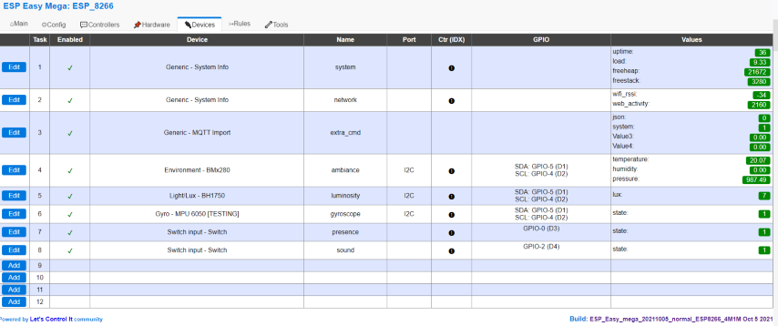

# ESP-8266-Sensors

1. [Hardware](#hardware)
   1. [Pinout](#pinout)
2. [Firmware](#firmware)
    1. [Source](#source)
    2. [Download](#download)
3. [Integration](#integration)
4. [Setup](#setup)
5. [Templates](#templates)
    1. [Files](#files)
    2. [Constants](#constants)
6. [Programming](#programming)
7. [Access](#access)
    1. [Web](#web)
    2. [MQTT](#mqtt)
        1. [Topics](#topics)
            1. [Coming from the ESPEasy rules](#coming-from-the-espeasy-rules)
            2. [Coming from the OpenHAB 3 rules](#coming-from-the-openhab-3-rules)
        2. [Commands](#commands)
8. [Links](#links)

## Hardware
Using a cheaper and simple `D1-mini`: 

### Pinout
- 

## Firmware

It needs to be compiled prior to be uploaded in the device. For that we use a dedicated file to set up the build and
configure the firmware and a couple of files to configure the device.

### Source

[https://github.com/letscontrolit/ESPEasy](https://github.com/letscontrolit/ESPEasy)

### Download

EAsyMega
[https://github.com/esprfid/esp-rfid/tags](https://github.com/esprfid/esp-rfid/tags)

## Integration

- [Cf. Integration matrix/ESP_8266_Sensors](Integration_matrix.md#ESP_8266_Sensors)

## Setup

1. Uncompress the zip file `ESPEasy-Mega-VERSION.zip` downloaded
2. Use the file TEMPLATE provided for the settings and the user file to configure your firmware/device:

## Templates

### Files

| Component | Sub component | Template file                                              | Generated file                                                         | Comment      |
|-----------|---------------|------------------------------------------------------------|:-----------------------------------------------------------------------|--------------|
| ESP       | PlatformIO    | `ESP/ESP_8266_Sensors/platformio.ini`                      | `generated/ESP/ESP_8266_Sensors/platformio.ini`                        |              |
| ESP       | Firmware      | `ESP/ESP_8266_Sensors/config.dat`                          | `generated/ESP/ESP_8266_Sensors/config.dat`                            |              |
| ESP       | Firmware      | `ESP/ESP_8266_Sensors/rules1.txt`                          | `generated/ESP/ESP_8266_Sensors/rules1.txt`                            |              |
| ESP       | Firmware      | `ESP/ESP_8266_Sensors/rules2.txt`                          | `generated/ESP/ESP_8266_Sensors/rules2.txt`                            |              |
| ESP       | Firmware      | `ESP/ESP_8266_Sensors/rules4.txt`                          | `generated/ESP/ESP_8266_Sensors/rules4.txt`                            |              |
| OpenHAB   | API           | `OpenHAB/API/ESP_8266_Sensors/items_TEMPLATE.json`         | `generated/OpenHAB/API/ESP_8266_Sensors/items_[ESP_NAME].json`         |              | 
| OpenHAB   | API           | `OpenHAB/API/ESP_8266_Sensors/links_TEMPLATE.json`         | `generated/OpenHAB/API/ESP_8266_Sensors/links_[ESP_NAME].json`         |              | 
| OpenHAB   | API           | `OpenHAB/API/ESP_8266_Sensors/rules_TEMPLATE.json`         | `generated/OpenHAB/API/ESP_8266_Sensors/rules_[ESP_NAME].json`         |              | 
| OpenHAB   | API           | `OpenHAB/API/ESP_8266_Sensors/things_TEMPLATE.json`        | `generated/OpenHAB/API/ESP_8266_Sensors/things_[ESP_NAME].json`        |              | 
| OpenHAB   | Web pages     | `OpenHAB/web_pages/ESP_8266_Sensors/Overview_HEADER.yml`   | `generated/OpenHAB/web_pages/ESP_8266_Sensors/Overview.yml`            |              |
| OpenHAB   | Web pages     | `OpenHAB/web_pages/ESP_8266_Sensors/Overview_TEMPLATE.yml` | `generated/OpenHAB/web_pages/ESP_8266_Sensors/Overview_[ESP_NAME].yml` |              |
| OpenHAB   | Web pages     | `OpenHAB/web_pages/ESP_8266_Sensors/Page_TEMPLATE.yml`     | `generated/OpenHAB/web_pages/ESP_8266_Sensors/Page_[ESP_NAME].yml`     |              |
| HABPanel  | Web pages     | `HABOpen/web_pages/ESP_8266_Sensors/RFID_TEMPLATE.yml`     | `generated/HABOpen/web_pages/ESP_8266_Sensors/RFID_[ESP_NAME].yml`     |              |
| NodeRED   | Workflow      | `NodeRED/ESP_8266_Sensors/functions.json`                  | `generated/NodeRED/ESP_8266_Sensors/functions.json`                    | no more used |
| NodeRED   | Workflow      | `NodeRED/ESP_8266_Sensors/settings_TEMPLATE.json`          | `generated/NodeRED/ESP_8266_Sensors/settings_[ESP_NAME].json`          | no more used |

### Constants

- ESP_NAME
- ESP_REFERENCE
- ROW_REFERENCE
- OPENHAB_WEB_URL

## Programming

Follow the editor's guide ([README.md](https://github.com/esprfid/esp-rfid#readme) file).

In summary: depending on your pf

- Windows: **Using Compiled Binaries**: Download compiled binaries from GitHub Releases
  page https://github.com/esprfid/esp-rfid/releases On Windows you can use "flash.bat", it will ask you which COM port
  that ESP is connected and then flashes it.
- Building With PlatformIO: The build environment is based on PlatformIO. Follow the instructions found
  here: http://platformio.org/#!/get-started for installing it but skip the platform init step as this has already been
  done, modified and it is included in this repository.

````commandline
sudo pip install -U pip setuptools
sudo pip install -U platformio
git clone https://github.com/esprfid/esp-rfid.git
cd esp-rfid
platformio run -t clean
platformio run
````

_Tips_: when you have huge number of devices, use the file explorer to upload the generic files on all of your devices
and just adapt the needs (ie ES Pref and IP address):

- Config: `ESP/config.dat`
- Rules
    - `./ESP/rules1.txt`
    - `./ESP/rules2.txt`
    - `./ESP/rules4.txt`




Ready to be used!

## Access

Pretty well documented [here](https://github.com/easytarget/esp32-cam-webserver/blob/master/API.md).

### Web

- TCP Port:  **80**
- Flow: **In/Out**

### MQTT

- TCP Port: **1883**
- Flow: **Out**

#### Topics

OH3 enriches the original MQTT collection through the _OH3 Rules_ to provide additional MQTT stories for an easy-to-use
mode.

##### Coming from the ESPEasy rules

Setup in: `ESP/ESP_8266_Sensors/rules1.txt`

| Category | Name        | Topic                                      | Value                                                                   | Value type | Value definition             |
|----------|-------------|--------------------------------------------|-------------------------------------------------------------------------|------------|------------------------------|
| System   | Status      | `ESP/[ESP_REFERENCE]/LWT`                  | [Boot,Connected,Disconnected]                                           | string     | ESP status                   | 
| System   | Time        | `ESP/[ESP_REFERENCE]/system/time`          | \d*                                                                     | integer    | timestamp since 1970/1/1     |
| System   | Uptime      | `ESP/[ESP_REFERENCE]/system/uptime`        | \d*                                                                     | integer    | duration since last power on |
| System   | Load        | `ESP/[ESP_REFERENCE]/system/load`          | \d*.\d*                                                                 | float      | ESP load                     |
| System   | Heap        | `ESP/[ESP_REFERENCE]/system/freeheap`      | \d*.\d*                                                                 | float      | ESP free heap                |
| System   | Stack       | `ESP/[ESP_REFERENCE]/system/freestack`     | \d*.\d*                                                                 | float      | ESP free stack               |
| System   | Status      | `ESP/[ESP_REFERENCE]/system/status `       | [ok,Reboot,Connected,Disconnected,Connection lost,Boot,Sleep,Wake,Load] | string     | ESP full status              |
| Sensor   | Luminosity  | `ESP/[ESP_REFERENCE]/luminosity/lux`       | \d*                                                                     | integer    | Luminosity value in Lux      |
| Sensor   | Temperature | `ESP/[ESP_REFERENCE]/ambiance/temperature` | \d*                                                                     | float      | Temperature value in °C      |
| Sensor   | Pressure    | `ESP/[ESP_REFERENCE]/ambiance/pressure`    | \d*                                                                     | float      | Pressure value in Pa         |
| Sensor   | Humidity    | `ESP/[ESP_REFERENCE]/ambiance/humidity`    | \d*                                                                     | float      | Humidity value in %          |
| Sensor   | Presence    | `ESP/[ESP_REFERENCE]/presence/state`       | [0,1]                                                                   | boolean    | Presence switch              |
| Sensor   | Motion      | `ESP/[ESP_REFERENCE]/gyroscope/state`      | [0,1]                                                                   | boolean    | Motion switch                |
| Network  | RSSI        | `ESP/[ESP_REFERENCE]/network/wifi_rssi`    | \d*                                                                     | integer    | Wifi RSSI signal             |
| Network  | Activity    | `ESP/[ESP_REFERENCE]/network/web_activity` | \d*                                                                     | integer    | Web activity                 |
| Network  | AP          | `ESP/[ESP_REFERENCE]/network/access_point` | [Changed]                                                               | string     | Access point switched        |
| MQTT     | Status      | `ESP/[ESP_REFERENCE]/mqtt/status`          | [Connected,Disconnected]                                                | string     | MQTT status                  | 
| MQTT     | Status      | `ESP/[ESP_REFERENCE]/import_mqtt/status`   | [Connected,Disconnected]                                                | string     | MQTT import status           | 

##### Coming from the OpenHAB 3 rules

Setup in: `OpenHAB/ESP_8266_Sensors/rules_TEMPLATE.txt`

| Category | Name       | Topic                                  | Value  | Value type | Value definition                |
|----------|------------|----------------------------------------|--------|------------|---------------------------------|
| System   | Alert      | `ESP/[ESP_REFERENCE]/system/alert`     | [0,1]  | boolean    | Global alert for the system     | 
| Sensor   | Alert      | `ESP/[ESP_REFERENCE]/sensor/alert`     | [0,1]  | boolean    | Global alert for the sensor     |
| Sensor   | Luminosity | `ESP/[ESP_REFERENCE]/luminosity/state` | [0,1]  | boolean    | Convert analog value to boolean |

#### Commands

Setup in: `ESP/ESP_8266_Sensors/rules2.txt`

- `mosquitto_pub -h [MQTT_HOST] -t [TOPIC_COMMAND] -m '{"doorip":"[ESP_IP_ADDRESS]","cmd":"[ACTION]"}'`
- Where
    - [MQTT_HOST]: Host providing the MQTT server, should be _Domo_
    - [TOPIC_COMMAND]: Topic to be reached by the command
    - [ESP_IP_ADDRESS]: ESP IP address reachable over the network
    - [ACTION]: requested action

| Category | Action  | Topic command                    | Topic value  | Result topic                        | Command result                                                                                                                                                                                                                                  |
|----------|---------|----------------------------------|--------------|-------------------------------------|-------------------------------------------------------------------------------------------------------------------------------------------------------------------------------------------------------------------------------------------------|
| Report   | Result  | `ESP/[ESP_REFERENCE]/cmd/json`   | 0            | `ESP/[ESP_REFERENCE]/json/result`   | Ok                                                                                                                                                                                                                                              |
| Report   | Map     | `ESP/[ESP_REFERENCE]/cmd/json`   | 1            | `ESP/[ESP_REFERENCE]/json/map`      | {"0": "result", "1": "map", "2": "status", "3": "system", "4": "network", "timestamp": "%unixtime%"}                                                                                                                                            |
| Report   | Status  | `ESP/[ESP_REFERENCE]/cmd/json`   | 2            | `ESP/[ESP_REFERENCE]/json/status`   | {"wifi": %iswifi%, "ntp": %isntp%, "mqtt": %ismqtt%, "mqtt_import": %ismqttimp%, "timestamp": "%unixtime%"}                                                                                                                                     |
| Report   | System  | `ESP/[ESP_REFERENCE]/cmd/json`   | 3            | `ESP/[ESP_REFERENCE]/json/system`   | {"Name": "%sysname%", "Unit": "%unit%", "Load": "%sysload%", "Heap": "%sysheap%", "Stack": "%sysstack%", "Time": "%systime%", "Uptime": "%uptime%", "Build_Git": "%sysbuild_git%", "Build_Date": "%sysbuild_date%", "timestamp": "%unixtime%"}  |
| Report   | Network | `ESP/[ESP_REFERENCE]/cmd/json`   | 4            | `ESP/[ESP_REFERENCE]/json/network`  | {"MAC": "%mac%", "IP": "%ip%", "Subnet": "%subnet%", "Gateway": "%gateway%", "DNS": "%dns%", "RSSI": "%rssi%", "SSID": "%ssid%", "BSSID": "%bssid%", "WifiChannel": "%wi_ch%", "timestamp": "%unixtime%"}                                       |
| System   | Result  | `ESP/[ESP_REFERENCE]/cmd/system` | 0            | `ESP/[ESP_REFERENCE]/system/result` | Ok                                                                                                                                                                                                                                              |
| System   | Map     | `ESP/[ESP_REFERENCE]/cmd/system` | 1            | `ESP/[ESP_REFERENCE]/system/map`    | {"0": "result", "1": "map", "2": "reboot", "3": "reload", "timestamp": "%unixtime%"}                                                                                                                                                            |
| System   | Reboot  | `ESP/[ESP_REFERENCE]/cmd/system` | 2            | `ESP/[ESP_REFERENCE]/system/result` | Ok                                                                                                                                                                                                                                              |
| System   | Reload  | `ESP/[ESP_REFERENCE]/cmd/system` | 3            | `ESP/[ESP_REFERENCE]/system/result` | Ok                                                                                                                                                                                                                                              |

## Links

- Plugin list: https://www.letscontrolit.com/wiki/index.php/Official_plugin_list