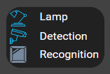
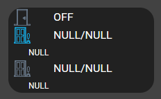
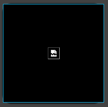
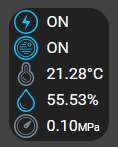

# HABPanel

1. [Installation](#installation)
    1. [Images](#images)
    2. [Layout](#layout)
2. [Configuration](#configuration)
3. [Templates](#templates)
    1. [Files](#files)
    2. [Constants](#constants)
    3. [Screenshots](#screenshots)
4. [Links](#links)

## Installation

Login to OH3 and deploy it by following the next instruction:

1. `Parameters -> User Interfaces -> + -> HABPanel`
2. Install

Wait and see ^^

## Configuration

### Images

Copy and/or change the image files in your OpenHab instance in the static web server folder:

- Source:
    - `HABPanel/images/second_floor.png`
    - `HABPanel/images/first_floor.png`
    - `HABPanel/images/ground.png`
    - `HABPanel/images/outdoor.png`
- Destination:
    - `/etc/openhab/html/images/`

So the images can be browsed on the following url: https://opnehab:8443/static/images/{IMAGE_NAME}.png

They are used as background images of the HABPanel floor displays.

### Layout

1. Create each single page as layout that you need (cf. [filelist](#files))
2. Copy/paste the content of the files generated in `generated/HABPanel` to populate the source code in each page.

## Templates

At this time only static pages are provided and an additional one named `HABPanel/web_pages/test.html` provides an example of
generic _templates_ (name of the HABPanel component to define HTML page).

You can reuse it to build your own page and of course, as example to create your own!

### Files

| Name         | Type       | Template file                                   | Generated file                                              |
|--------------|------------|:------------------------------------------------|-------------------------------------------------------------|
| Second floor | Web page   | `HABPanel/web_pages/second_floor_TEMPLATE.html` | `generated/HABPanel/web_pages/second_floor_[ESP_NAME].html` |
| First floor  | Web page   | `HABPanel/web_pages/first_floor_TEMPLATE.html`  | `generated/HABPanel/web_pages/first_floor_[ESP_NAME].html`  |
| Ground       | Web page   | `HABPanel/web_pages/ground_TEMPLATE.html`       | `generated/HABPanel/web_pages/ground_[ESP_NAME].html`       |
| Outdoor      | Web page   | `HABPanel/web_pages/outdoor_TEMPLATE.html`      | `generated/HABPanel/web_pages/outdoor_[ESP_NAME].html`      |
| Camera       | Icon tpl   | `HABPanel/web_pages/Camera_TEMPLATE.html`       | `generated/HABPanel/web_pages/Camera_[ESP_NAME].html`       |
| RFID         | Icon tpl   | `HABPanel/web_pages/RFID_TEMPLATE.html`         | `generated/HABPanel/web_pages/RFID_[ESP_NAME].html`         |
| Streaming    | Icon tpl   | `HABPanel/web_pages/streaming_TEMPLATE.html`    | `generated/HABPanel/web_pages/streaming[ESP_NAME].html`     |
| Sensors      | Icon tpl   | `HABPanel/web_pages/sensors_TEMPLATE.html`      | `generated/HABPanel/web_pages/sensors_[ESP_NAME].html`      |
| Test         | Icon tpl   | `HABPanel/web_pages/test_TEMPLATE.html`         | `generated/HABPanel/web_pages/test_[ESP_NAME].html`         |
| Second floor | Web page   | `HABPanel/images/second_floor.png`              | `generated/HABPanel/images/second_floor.png`                |
| First floor  | BckGrd img | `HABPanel/images/first_floor.png`               | `generated/HABPanel/images/first_floor.png`                 |
| Ground       | Web page   | `HABPanel/images/ground.png`                    | `generated/HABPanel/images/ground.png`                      |
| Outdoor      | Web page   | `HABPanel/images/outdoor.png`                   | `generated/HABPanel/images/outdoor.png`                     |

### Constants

- ESP_NAME
- ESP_IP_ADDRESS

Only for the `test.html` file:
- ESP_NAME_32_CAM      <> ESP_NAME
- ESP_NAME_8266_RFID   <> ESP_NAME
- ESP_NAME_8266_SENSOR <> ESP_NAME

### Screenshots

| Name      | Screenshot                                 |
|-----------|--------------------------------------------|
| Camera    |     |
| Door      |       |
| Streaming |  |
| Sensors   |    |

## Links
