# Integration matrix

<table style="width: 100%;">
    <thead>
        <tr>
            <th style="width: 4%;">Usage</th>
            <th style="width: 7%;">Hardware</th>
            <th style="width: 19%;">Description</th>
            <th style="width: 2%;">Setup & Conf</th>
            <th style="width: 2%;">Templates</th>
            <th style="width: 2%;">Firmware factory</th>
            <th style="width: 20%;">ESP HW/GUI</th>
            <th style="width: 20%;">OH3 Overview/Page</th>
            <th style="width: 4%;">Link</th>
        </tr>
    </thead>
    <tbody>
        <tr>
            <td style="width: 7%;" name="ESP_32_Cam">Web cam</td>
            <td style="width: 4%;">ESP-32-Cam + Web_cam</td>
            <td style="width: 20%;">Video streaming and camera settings management</td>
            <td style="width: 3%; text-align: center;">&#10004;</td>
            <td style="width: 3%; text-align: center;">&#10004;</td>
            <td style="width: 3%; text-align: center;">&#10008;</td>
            <td style="width: 25%;">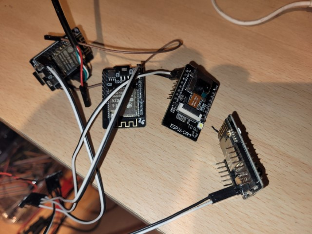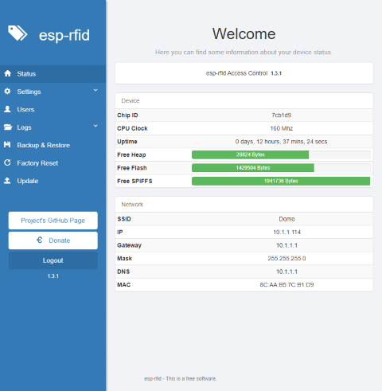</td>
            <td style="width: 25%;">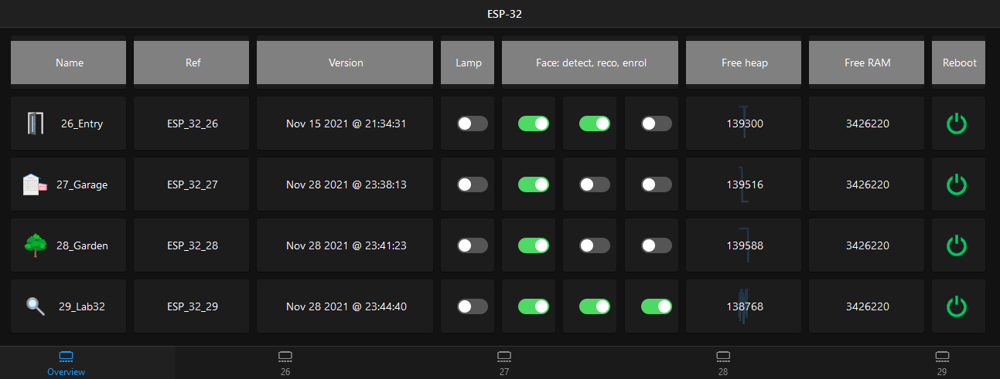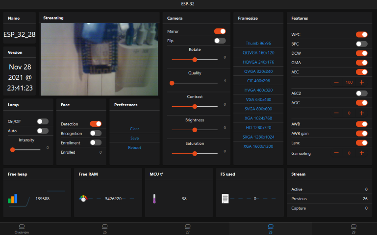</td>
            <td style="width: 10%;"><a href="https://github.com/easytarget/esp32-cam-webserver">GitHub</a></td>
        </tr>
        <tr>
            <td style="width: 7%;" name="ESP_8266_Sensors">Sensors</td>
            <td style="width: 4%;">ESP-8266 D1-mini + <i>sensor(s)</i></td>
            <td style="width: 20%;">Measure and collect of: <ul><li>Temperature</li><li>luminosity</li><li>humidity</li><li>sound</li><li>presence</li><li>motion</li><li>water pump</li><li>sole moisture</li></ul></td>
            <td style="width: 3%; text-align: center;">&#10004;</td>
            <td style="width: 3%; text-align: center;">&#10004;</td>
            <td style="width: 3%; text-align: center;">&#10004;</td>
            <td style="width: 25%;">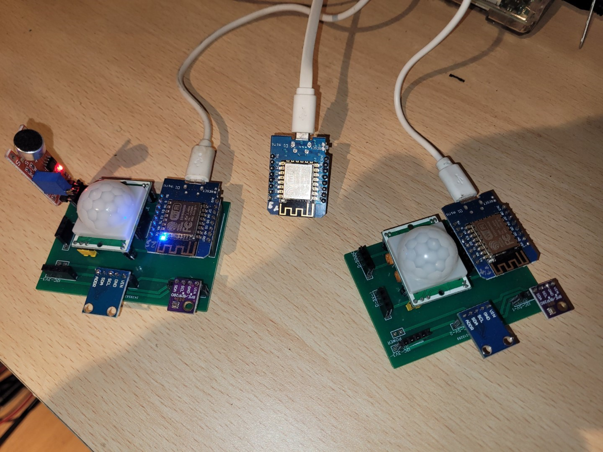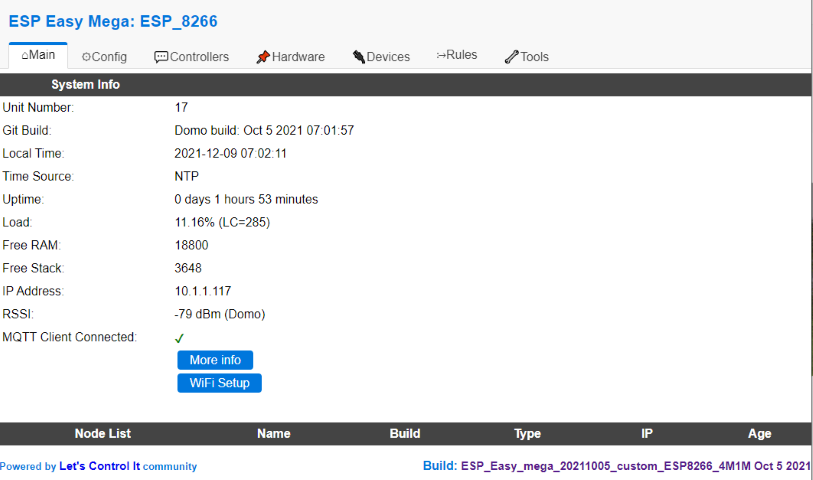</td>
            <td style="width: 25%;">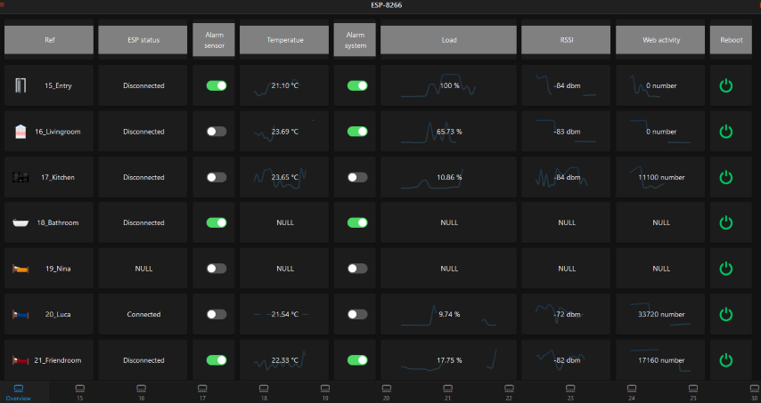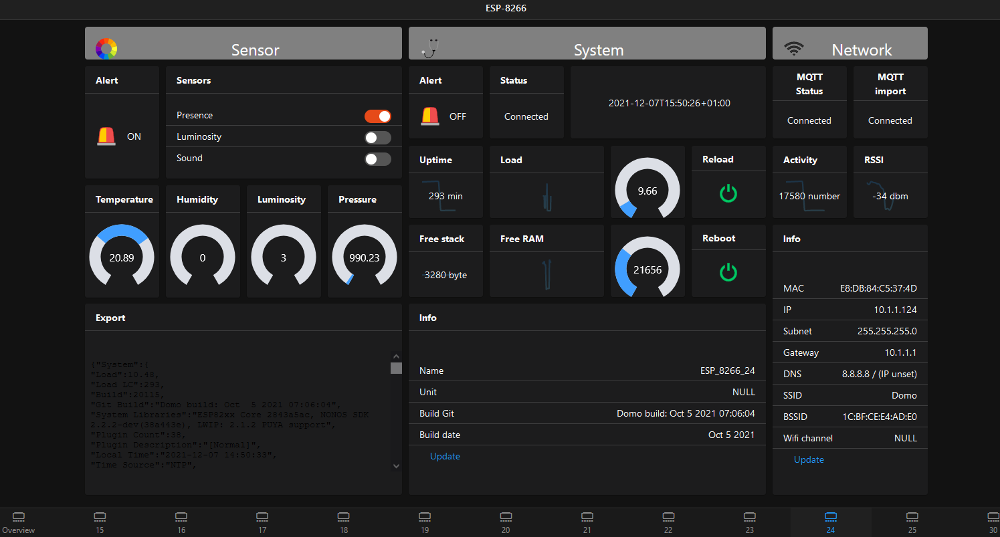</td>
            <td style="width: 10%;"><a href="https://github.com/letscontrolit/ESPEasy">GitHub</a></td>
        </tr>
        <tr>
            <td style="width: 7%;" name="ESP_8266_RFID">RFID</td>
            <td style="width: 4%;">ESP-8266 D1-mini + RFID-RC522</td>
            <td style="width: 20%;">Open door management control system</td>
            <td style="width: 3%; text-align: center;">&#10004;</td>
            <td style="width: 3%; text-align: center;">&#10004;</td>
            <td style="width: 3%; text-align: center;">&#10008;</td>
            <td style="width: 25%;">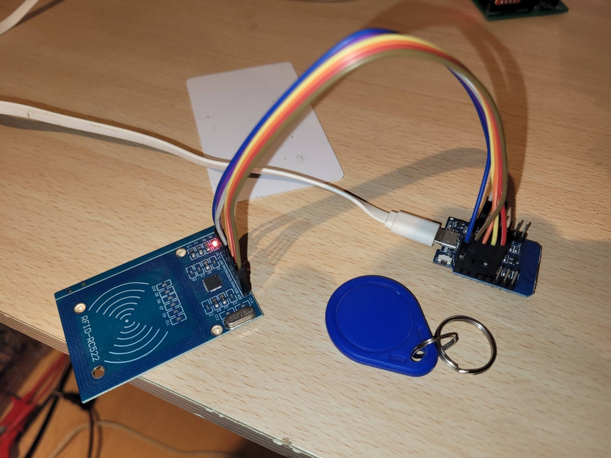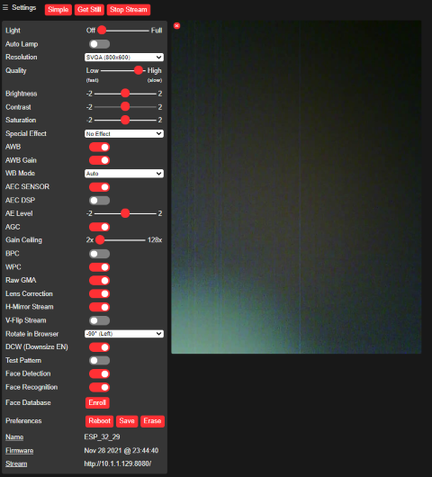</td>
            <td style="width: 25%;">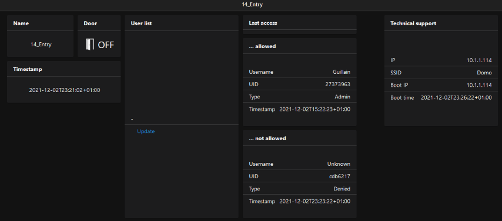</td>
            <td style="width: 10%;"><a href="https://github.com/esprfid/esp-rfid">GitHub</a></td>
        </tr>
        <tr>
            <td style="width: 7%;" name="ESP_8266_Repeater">Wifi repeater</td>
            <td style="width: 4%;">ESP-8266 D1-mini</td>
            <td style="width: 20%;">Wifi AP extender</td>
            <td style="width: 3%; text-align: center;">&#10008;</td>
            <td style="width: 3%; text-align: center;">&#10008;</td>
            <td style="width: 3%; text-align: center;">&#10008;</td>
            <td style="width: 25%;"></td>
            <td style="width: 25%;"></td>
            <td style="width: 10%;"><a href="https://github.com/martin-ger/esp_wifi_repeater">GitHub</a></td>
        </tr>
        <tr>
            <td style="width: 7%;" name="ESP_8266_Intercom">Intercom</td>
            <td style="width: 4%;">ESP-8266 D1-mini + switch + mic + speaker</td>
            <td style="width: 20%;">House ringer which raise SMS and voice call</td>
            <td style="width: 3%; text-align: center;">&#10008;</td>
            <td style="width: 3%; text-align: center;">&#10008;</td>
            <td style="width: 3%; text-align: center;">&#10008;</td>
            <td style="width: 25%;"></td>
            <td style="width: 25%;"></td>
            <td style="width: 10%;"><a href="https://www.twilio.com">Twilio</a></td>
        </tr>
        <tr>
            <td style="width: 7%;" name="RPI_4_Jarvis">Jarvis</td>
            <td style="width: 4%;">RPI4 + camera + 2*lights + mic + speaker</td>
            <td style="width: 20%;">Conversational bot for command and usage</td>
            <td style="width: 3%; text-align: center;">&#10007;</td>
            <td style="width: 3%; text-align: center;">&#10007;</td>
            <td style="width: 3%; text-align: center;">&#10007;</td>
            <td style="width: 25%;">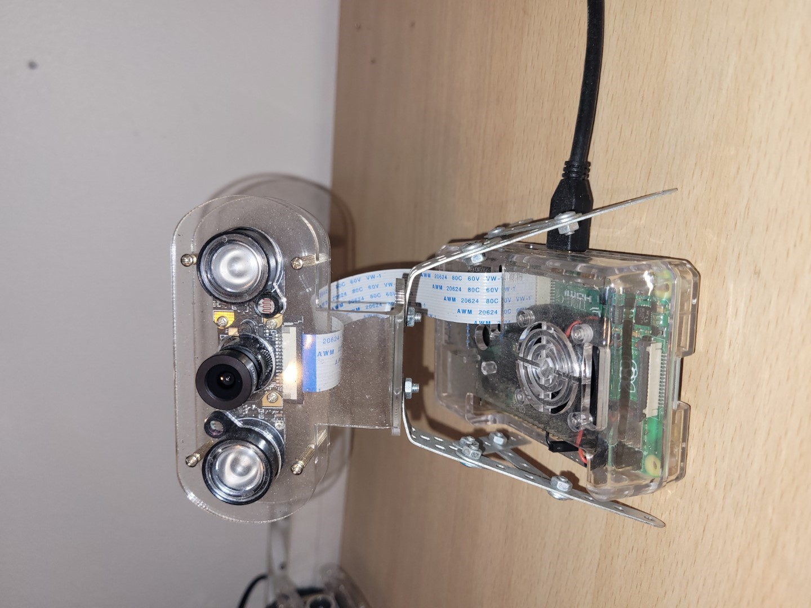</td>
            <td style="width: 25%;"></td>
            <td style="width: 10%;"><a href="https://github.com/guillain/CoreBot">CoreBot</a></td>
        </tr>
        <tr>
            <td style="width: 7%;" name="iRobot">iRobot</td>
            <td style="width: 4%;">NodeMCU + ESP-8266 D1-mini + sensors + RGB + buzzer</td>
            <td style="width: 20%;">iPet</td>
            <td style="width: 3%; text-align: center;">&#10007;</td>
            <td style="width: 3%; text-align: center;">&#10007;</td>
            <td style="width: 3%; text-align: center;">&#10007;</td>
            <td style="width: 25%;">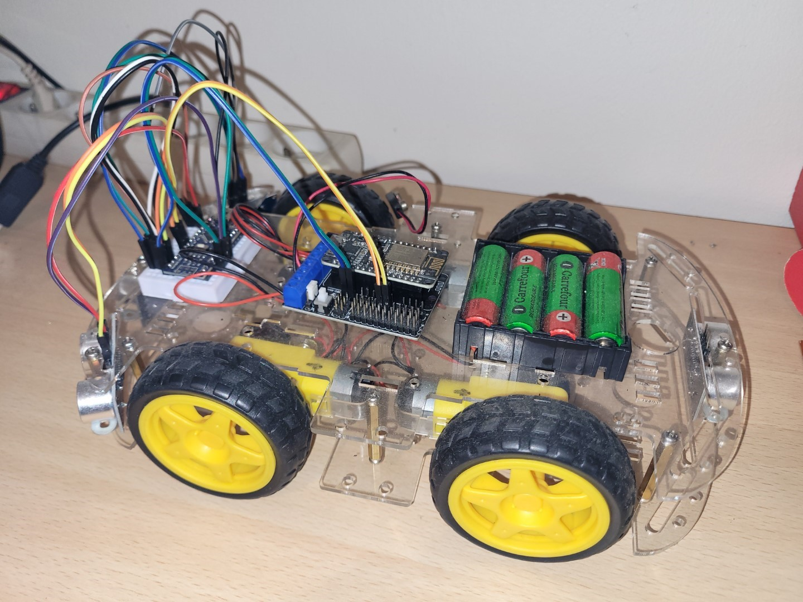</td>
            <td style="width: 25%;"></td>
            <td style="width: 10%;"></td>
        </tr>
        <tr>
            <td style="width: 7%;" name="RPI_3_Matrix_creator">Matrix creator</td>
            <td style="width: 4%;">RPI3 + sensors + RGB + camera</td>
            <td style="width: 20%;">RGB lights and camera for funny party</td>
            <td style="width: 3%; text-align: center;">&#10007;</td>
            <td style="width: 3%; text-align: center;">&#10007;</td>
            <td style="width: 3%; text-align: center;">&#10007;</td>
            <td style="width: 25%;">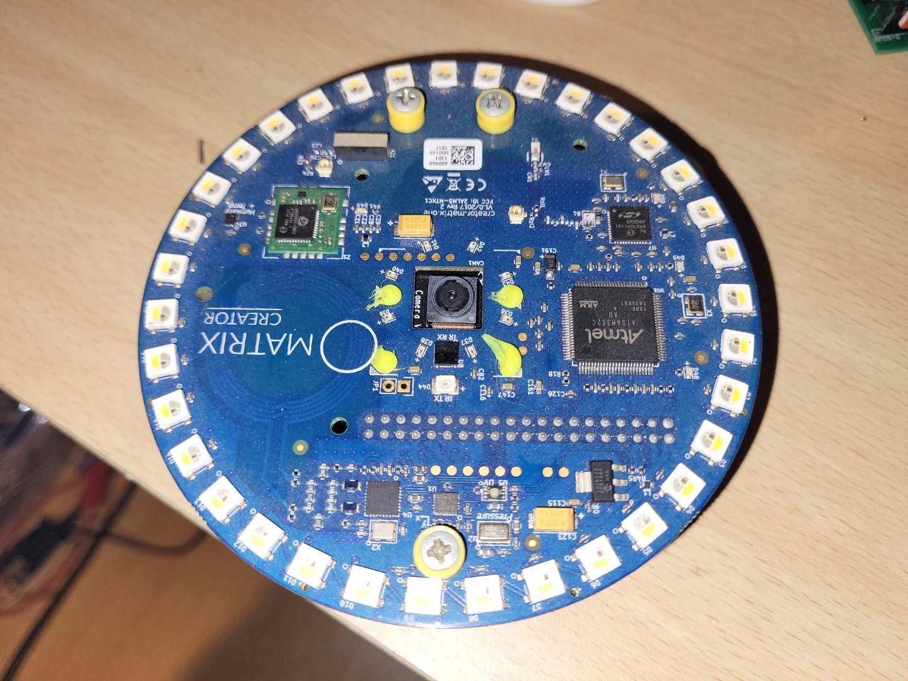</td>
            <td style="width: 25%;"></td>
            <td style="width: 10%;"></td>
        </tr>
    </tbody>
</table>
